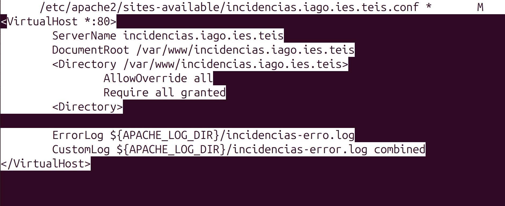

# Manual de instalacion de la aplicacion web

## Decisiones de proyecto
|Elemento|Decision|Version|Justificacion|
|--------|-------|--------|-------------|
|Servidor web|Apache|2|Sencillo de usar, popular|
|Base de datos|MYSQL|8|Experiencia previa, popular|
|Lenguaje de servidor|Python|3|Muy interesante para ASIR, uso extendido|
|Framework|Flask|3|Sencillo de usar, pensado expecificamente para web/formularios, sesiones|
|Control de versiones|Git|2|Muy extendido|
|Documentacion|Markdown|-|Muy utilizado con git|

## Que hace un servidor web
Recibe solicitudes http de clientes y responde con la pagina web solicitada al navegador

## Proceso de INSTALACION / puesta en marcha

1. Actualizar el sistema
` sudo apt update `
` sudo apt upgrade `
2. Instalar git
` sudo apt install git `
3. Instalar VS Code + Plugins
` MarkDown all in one `
4. Instalar git gui
` sudo apt install git-gui `
. Instalar apache2
` sudo apt install apache2 `
5. Cambiar permisos carpeta /var/www/html
` sudo chown -R $USER:$USER /var/www/html`
`sudo chmod -R u=rwX,go=rX /var/www/html`
6. Archivo apache

7. Configurar el archivo creado como default
   
    ` sudo a2dissite 000-default.conf  `

    ` sudo a2ensite incidencias.iago.ies.teis `  

    ` systemctl reload apache2 `
